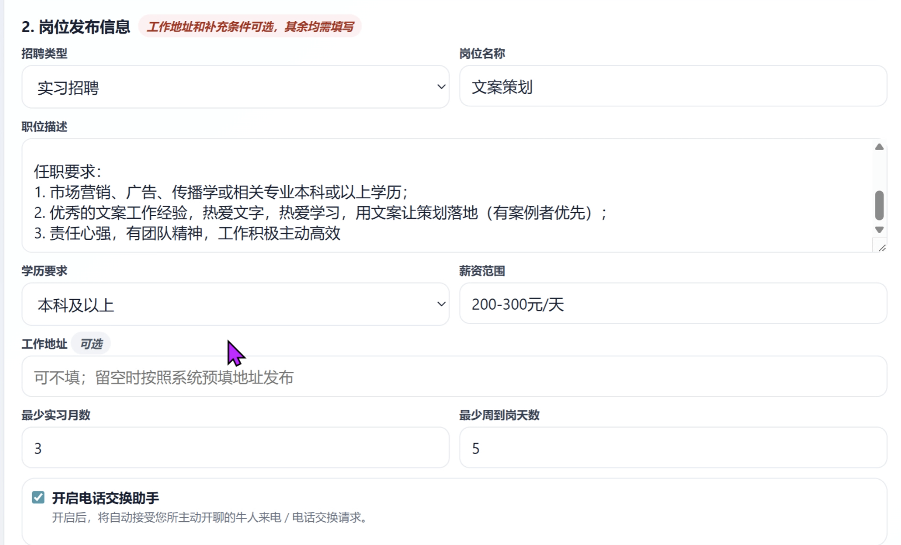
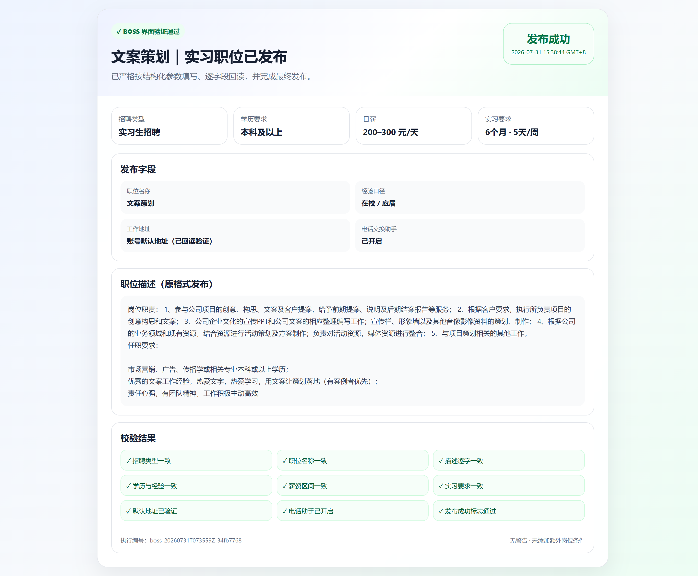
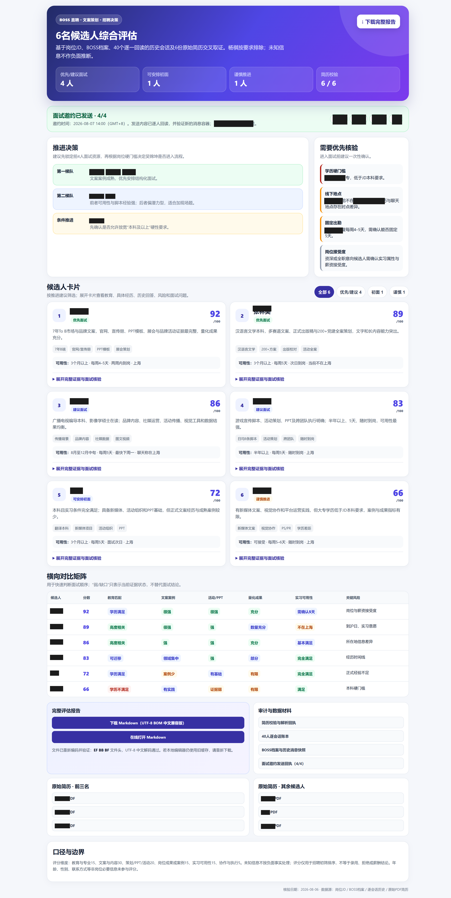
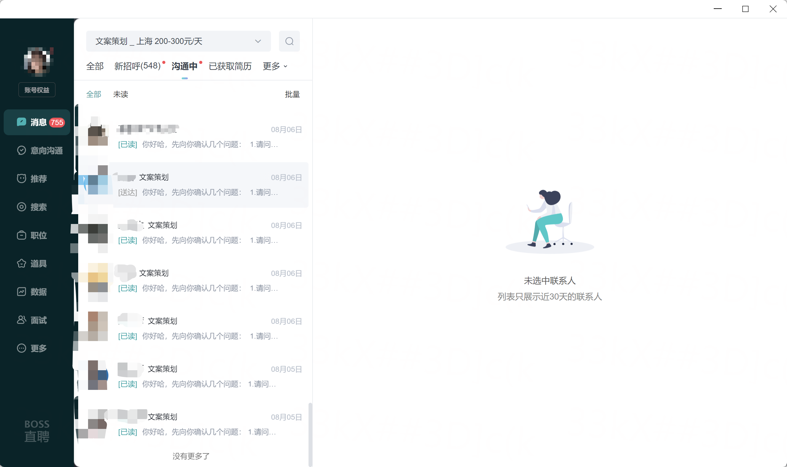
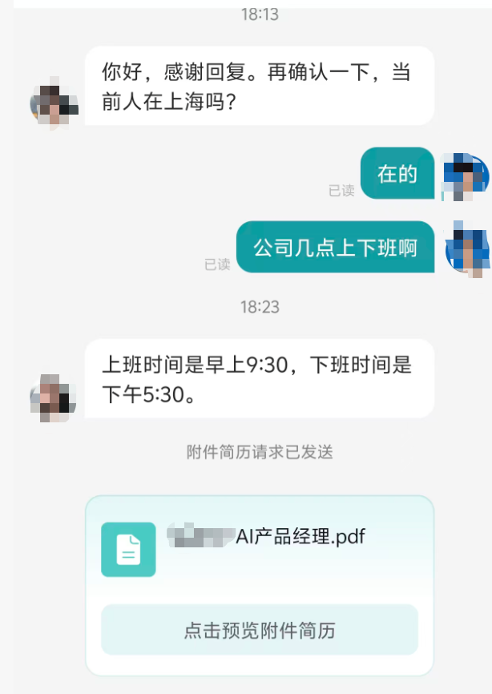
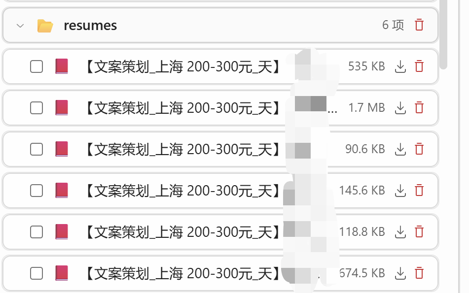

# BOSS 直聘 Windows 桌面端 Skill 合集

这是一组面向 Codex / ChatGPT Agent 的 Windows 桌面自动化 Skill，通过 `pywinauto` 与 Windows UI Automation（UIA）操作 BOSS 直聘桌面客户端。

仓库包含四个彼此独立、可组合使用的 Skill。每个 Skill 都以自己的 `SKILL.md` 作为完整行为规范，并附带完成任务所需的脚本、Schema、模板或运行时资源。

> [!IMPORTANT]
> 本项目是非官方开源项目，与 BOSS 直聘及其运营主体不存在隶属、合作、赞助或认可关系。“BOSS 直聘”及相关名称、标识的权利归其权利人所有。使用者应自行确认其使用方式符合适用法律、组织政策和平台最新协议，并仅操作自己有权使用的账号与数据。

## 包含的 Skill

| Skill | 标识符 | 主要能力 |
| --- | --- | --- |
| [候选人初评分](./BOSS直聘桌面端-候选人初评分/) | `boss-candidate-scoring` | 读取指定岗位要求，仅从“消息”入口采集候选人，并进行有证据边界的初步评分 |
| [候选人打招呼和消息交互](./BOSS直聘桌面端-候选人打招呼和消息交互/) | `boss-candidate-messaging` | 岗位筛选、候选人和会话读取、语义翻页、会话检查、已验证消息发送与批量编排 |
| [索要与收取简历](./BOSS直聘桌面端-索要与收取简历能力/) | `boss-resume-request-collection` | 请求简历、发送普通邀请、接收与下载附件、文件校验、哈希计算及 PDF/DOCX 解析 |
| [岗位发布](./BOSS直聘桌面端-岗位发布/) | `boss-job-publishing` | 填写、回读核验并发布 BOSS 直聘实习岗位，以及核对结果不确定的提交 |

## 运行环境

- Windows 交互式桌面环境；锁屏或远程会话断开时，UI 自动化可能无法运行。
- 已安装并登录有权使用的 BOSS 直聘 Windows 桌面客户端。
- Python 与各 Skill 声明的依赖。候选人初评分 Skill 明确支持 Python 3.11–3.13。
- 当前自动化选择器主要按 BOSS 中文招聘端 `1.7.4.963` 验证。客户端更新后，应先验证 UIA 结构，不能用固定坐标或 OCR 绕过安全失败。

具体支持范围、初始化命令和安全边界以各目录中的 `SKILL.md` 为准。

## 安装

先克隆仓库：

```powershell
git clone https://github.com/9-dream-come-true-9/boss-zhipin-desktop-skills.git
Set-Location .\boss-zhipin-desktop-skills
```

然后把需要的 Skill 复制到个人 Skill 目录。下面的命令不会主动删除已有目录；如果目标同名目录已经存在，请先自行检查并决定如何处理。

```powershell
$skillsRoot = Join-Path $HOME '.agents\skills'
New-Item -ItemType Directory -Path $skillsRoot -Force | Out-Null

Copy-Item -LiteralPath '.\BOSS直聘桌面端-候选人初评分' `
  -Destination (Join-Path $skillsRoot 'boss-candidate-scoring') -Recurse

Copy-Item -LiteralPath '.\BOSS直聘桌面端-候选人打招呼和消息交互' `
  -Destination (Join-Path $skillsRoot 'boss-candidate-messaging') -Recurse

Copy-Item -LiteralPath '.\BOSS直聘桌面端-索要与收取简历能力' `
  -Destination (Join-Path $skillsRoot 'boss-resume-request-collection') -Recurse

Copy-Item -LiteralPath '.\BOSS直聘桌面端-岗位发布' `
  -Destination (Join-Path $skillsRoot 'boss-job-publishing') -Recurse
```

Codex 通常会自动检测 Skill 变更；如果没有出现，请重启 Codex。Skill 的标准目录结构与加载方式可参考 [OpenAI 官方文档：Build skills](https://learn.chatgpt.com/docs/build-skills)。

## 使用示例

安装后，可以在 Codex 中显式调用：

```text
$boss-candidate-scoring 评估“产品运营实习生”岗位的新招呼候选人。
```

```text
$boss-candidate-messaging 查看“前端开发实习生”岗位的未读会话，并根据我提供的话术回复。
```

```text
$boss-resume-request-collection 检查指定候选人是否已经发送简历；如果已发送，下载并解析原始附件。
```

```text
$boss-job-publishing 根据我提供的完整岗位信息发布一个实习岗位。
```

## 岗位发布示例

下面是 `$boss-job-publishing` 可读取的岗位信息输入示例，包含招聘类型、岗位名称、职位要求、学历、薪资、实习周期和电话交换助手设置。

[](./examples/job-publishing/BOSS直聘桌面端-文案策划｜岗位发布-输入模范.png)

下面展示 `$boss-job-publishing` 完成结构化填写、逐字段回读、最终发布和结果核验后的输出示例。示例岗位为“文案策划”实习职位，图片包含发布字段、原格式职位描述、逐项校验结果和发布成功状态。

[](./examples/job-publishing/BOSS直聘桌面端-文案策划｜岗位发布.png)

## 候选人初评分示例

下面展示 `$boss-candidate-scoring` 对“文案策划”岗位候选人进行初步评分和综合评估的示例。公开版本中的候选人姓名均已脱敏：工作簿统一替换为 `XXX`，综合评估图使用不透明遮挡。

- [下载 29 名候选人初评分工作簿（姓名脱敏版）](./examples/candidate-scoring/BOSS直聘桌面端-文案策划｜29名候选人初评分-姓名脱敏版.xlsx)

[](./examples/candidate-scoring/文案策划｜候选人综合评估.png)

## 候选人沟通示例

下面展示 `$boss-candidate-messaging` 在指定岗位下查看候选人会话、发送消息和衔接简历请求的界面示例。截图中的候选人姓名和头像已经像素化。

[](./examples/candidate-messaging/BOSS直聘桌面端-文案策划｜候选人打招呼和消息交互.png)

[](./examples/candidate-messaging/BOSS直聘桌面端-文案策划｜候选人打招呼和消息交互2.png)

## 简历索要与收取示例

下面展示 `$boss-resume-request-collection` 收取候选人简历附件后的文件列表示例。简历文件名中的候选人姓名已经遮挡。

[](./examples/resume-collection/BOSS直聘桌面端-索要与收取简历能力.png)

## 安全与隐私

- 提交运行示例前，应遮挡候选人姓名、联系方式等直接标识符，并确认自己有权公开剩余内容；本仓库示例中的候选人姓名已遮挡或替换为 `XXX`。
- 只在获得授权的招聘账号、岗位和候选人范围内使用这些 Skill。
- 发送消息、索要简历和发布岗位都会产生外部影响。运行前应理解对应 `SKILL.md` 中的提交边界、幂等控制与失败语义。
- 候选人评分只应作为有人工复核的初步辅助，不应替代最终招聘决定，也不应使用年龄、性别、婚育、照片、住址等与岗位无关或敏感的属性。
- 仓库中的 DOCX 是空白填写模板，不应在填写真实业务内容后重新提交到公开仓库。

## 版本

首个公开版本为 `v0.1.0`。

## 许可证

本仓库以 [Apache License 2.0](./LICENSE) 开源。第三方依赖、平台软件、产品名称和商标仍分别受其自身许可与权利约束。
